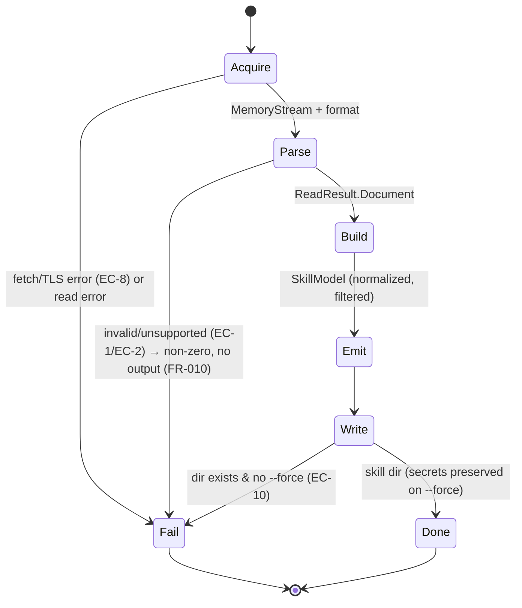

# Phase 1 Data Model — SkillModel (intermediate representation)

The **emitter-agnostic** model produced by `SkillModelBuilder` from an `OpenApiDocument`, consumed
by every emitter and by the shared `SKILL.md`/`reference`/secrets writers. This is the contract
between Parse and Emit (Constitution III) — emitters MUST depend only on this, never on
`Microsoft.OpenApi` types.

## Entities

### SkillModel (root)

| Field | Type | Notes |
|-------|------|-------|
| `Name` | string | Skill name — slug of `info.title` or `--name` override (FR-008) |
| `Title` | string | `info.title` (human) |
| `Description` | string? | `info.description` (trimmed for SKILL.md overview) |
| `Version` | string? | `info.version` |
| `BaseUrl` | string? | First `servers[].url`; null → user supplies at call time (EC-7) |
| `SpecVersion` | enum `OpenApi2_0 \| OpenApi3_0 \| OpenApi3_1 \| OpenApi3_2` | Detected source version (D5) |
| `SecuritySchemes` | `IReadOnlyList<SecuritySchemeModel>` | All schemes referenced by included ops |
| `Tags` | `IReadOnlyList<TagGroup>` | Ordered; operations grouped by tag for the index (D6) |
| `Warnings` | `IReadOnlyList<string>` | Non-fatal (e.g. unsupported scheme EC-6, no servers EC-7) |

### TagGroup

| Field | Type | Notes |
|-------|------|-------|
| `Tag` | string | Tag name, or `"default"` for untagged ops (EC-4, FR-004c) |
| `Summary` | string? | From `tags[].description` if present |
| `Operations` | `IReadOnlyList<OperationModel>` | Members of this tag |

### OperationModel

| Field | Type | Notes |
|-------|------|-------|
| `OperationId` | string | From spec, or synthesized `"{method}_{path}"` normalized (EC-3, FR-004c); unique after disambiguation (EC-5) |
| `Method` | enum HttpMethod | GET/POST/PUT/PATCH/DELETE/… |
| `PathTemplate` | string | e.g. `/pet/{petId}` |
| `Summary` | string? | One-line for the SKILL.md index |
| `Description` | string? | Longer, for `reference/<tag>.md` |
| `Parameters` | `IReadOnlyList<ParameterModel>` | path/query/header params |
| `RequestBody` | `RequestBodyModel?` | content type + schema summary |
| `SecurityRequirements` | `IReadOnlyList<string>` | scheme ids required (references `SecuritySchemes`); empty = none |
| `Responses` | `IReadOnlyList<ResponseModel>` | status + description (for reference doc) |

### ParameterModel

| Field | Type | Notes |
|-------|------|-------|
| `Name` | string | |
| `In` | enum `Path \| Query \| Header` | Cookie params out of MVP scope |
| `Required` | bool | |
| `Type` | string | JSON-schema-ish type hint (`string`,`integer`,…) for docs + CLI help |
| `Description` | string? | |

### RequestBodyModel

| Field | Type | Notes |
|-------|------|-------|
| `ContentType` | string | e.g. `application/json` |
| `Required` | bool | |
| `SchemaSummary` | string? | Rendered shape hint for reference doc (not full JSON Schema) |

### SecuritySchemeModel

| Field | Type | Notes |
|-------|------|-------|
| `Id` | string | Scheme key from `components.securitySchemes` |
| `Kind` | enum `ApiKey \| Bearer \| Basic \| OAuth2 \| Unsupported` | Maps spec type/scheme (D4); `Unsupported` → EC-6 warning |
| `ApiKeyName` | string? | header/query param name (ApiKey) |
| `ApiKeyLocation` | enum `Header \| Query`? | (ApiKey) |
| `OAuthTokenUrl` | string? | client-credentials token endpoint (OAuth2) |
| `OAuthScopes` | `IReadOnlyList<string>` | (OAuth2) |
| `SecretKeys` | `IReadOnlyList<string>` | secrets.json keys this scheme needs (e.g. `apiKey`, `bearerToken`, `username`+`password`, `clientId`+`clientSecret`) |

### ResponseModel

| Field | Type | Notes |
|-------|------|-------|
| `StatusCode` | string | `"200"`, `"default"`, … |
| `Description` | string? | |

## Derived: Secrets schema (secrets.example.json)

Generated from `SecuritySchemes[].SecretKeys` (OQ-1, OQ-5). One JSON object, one entry per scheme id:

```json
{
  "$comment": "Fill in real values. This file's real counterpart (secrets.json) is gitignored.",
  "apiKeyAuth":   { "apiKey": "" },
  "bearerAuth":   { "bearerToken": "" },
  "basicAuth":    { "username": "", "password": "" },
  "oauth2":       { "clientId": "", "clientSecret": "", "tokenUrl": "https://…/token", "scopes": [] },
  "baseUrl": "https://api.example.com"
}
```

`baseUrl` appears only when the spec has no `servers` (EC-7).

## Validation & normalization rules

- **operationId**: if missing → `Sanitize("{method}_{path}")`; on collision append `_2`, `_3`
  deterministically by document order (EC-3, EC-5).
- **tags**: op with no tag → `"default"` group (EC-4); tag order = document `tags[]` order, then
  first-seen for undeclared tags.
- **filters**: `--include`/`--exclude` applied on (tag | path | operationId) BEFORE grouping;
  `SecuritySchemes` recomputed from surviving ops only (FR-004b).
- **unsupported scheme**: `Kind=Unsupported` → add `Warnings` entry + a note in the op's reference
  section; op still listed (EC-6).
- **empty result** (no ops after parse/filter) → valid `SkillModel` with empty `Tags`; writers emit
  a minimal SKILL.md + warning (OQ-4).
- **determinism**: all collections emitted in a stable, sorted-or-document order so output is
  byte-stable (NFR-4).

## State (generation flow)


