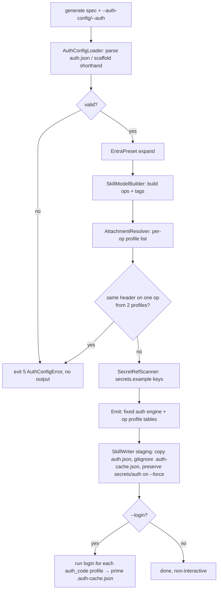
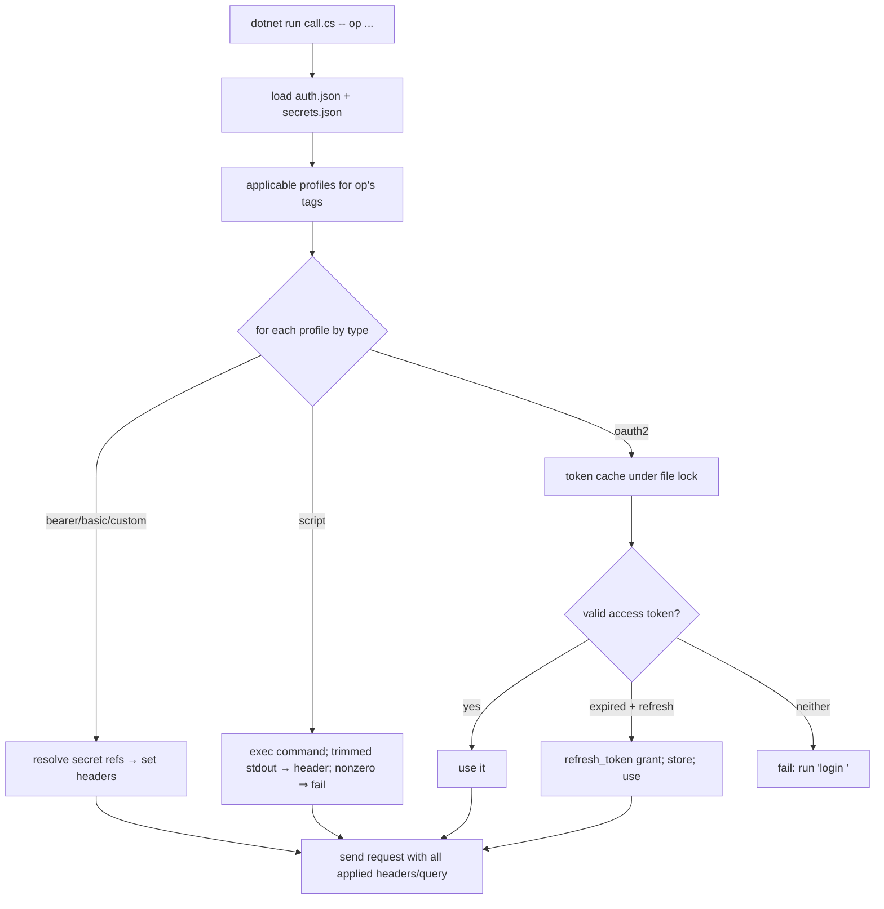
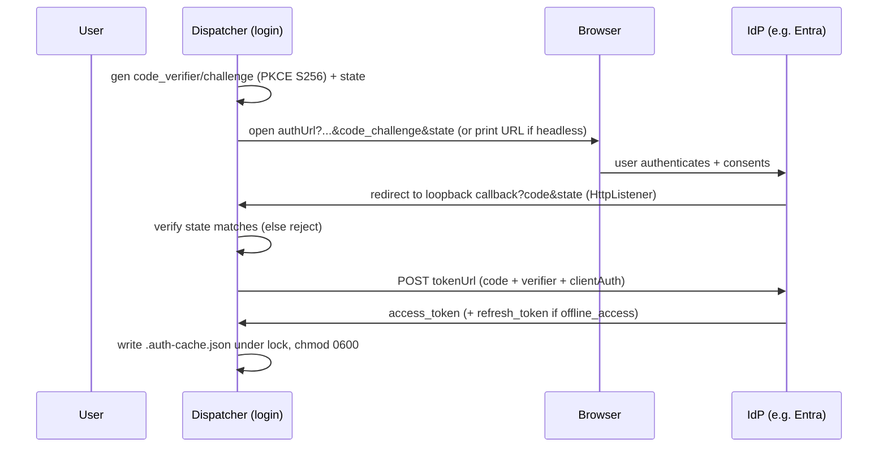

# Implementation Plan: Explicit Auth Configuration

**Branch**: `002-explicit-auth-config` | **Date**: 2026-07-11 | **Spec**: [spec.md](./spec.md)

**Input**: Feature specification from `specs/002-explicit-auth-config/spec.md`

## Summary

Let users **explicitly declare** how a generated skill authenticates — overriding the spec's
derived security — via a committed, secret-free **`auth.json`** of named **profiles**
(`bearer` | `script` | `oauth2` | `basic` | `custom`) attached globally or per **tag**, with
**multiple attached profiles all applying** to an operation. The generated dispatcher gains a
**fixed, API-independent auth engine** that reads `auth.json` at runtime, resolves `{secret:NAME}`
refs from `secrets.json`, and adds first-class **interactive OAuth** (authorization-code + PKCE +
`state`, public-client capable) via a `login <profile>` subcommand that opens a browser and
listens on a loopback callback, caching access/refresh tokens in a git-ignored, permission-locked
`.auth-cache.json` with **inter-process-locked** silent refresh. An **`entra` preset**, a
`script`-sourced credential type, and an opt-in generator `--login` round it out. Technical
approach from research: parse→model→emit unchanged; auth config validated at generation (collision
= hard error) and copied verbatim; the engine authored once per language (C# shared by `.cs`/
`.csx`, one F# translation) and verified by behavioral integration tests against stub IdP/API.

## Technical Context

**Language/Version**: C# on **.NET 10** (`net10.0`); generated `.cs` file-based apps, `.fsx`
(`dotnet fsi`), `.csx` (`dotnet-script`). No F#/C# language additions beyond current usage.

**Primary Dependencies**: Generator: `Microsoft.OpenApi` 3.8.0, `System.CommandLine` 2.0.x, plus
`System.Text.Json` **source-generator** context for `auth.json`. Generated dispatcher: **BCL only**
— `System.Net.Http`, `System.Net.HttpListener`, `System.Text.Json`, `System.Security.Cryptography`,
`System.Diagnostics.Process` (Constitution II).

**Storage**: Filesystem only. New per-skill files: committed `auth.json`; git-ignored
`.auth-cache.json` (+ `.auth-cache.json.lock`). `secrets.json` unchanged (git-ignored).

**Testing**: xUnit — unit (auth.json parse/validate, collision detection, secret-ref scan, PKCE/
state helpers), golden/snapshot (per-emitter auth engine text), integration (each generated
dispatcher vs. a stub OAuth IdP + stub API using the existing loopback `HttpListener` harness).

**Target Platform**: Cross-platform .NET CLI (macOS/Linux/Windows). Interactive login needs a
browser **or** manual URL paste (headless fallback). POSIX `0600` on cache; Windows ACL best-effort.

**Project Type**: CLI tool (single project `src/Api2Skill`) + generated-artifact templates.

**Performance Goals**: Not latency-critical. Generation stays **byte-stable** for a given (spec,
auth.json, options) tuple (NFR-4) — `auth.json` copied verbatim; PKCE/`state` are runtime-only.

**Constraints**: Zero third-party dep in generated code (Constitution II); no real credential in
any committed file (Constitution IV — `auth.json` + `secrets.example.json` are placeholders only);
no build step at call time (Constitution I); new profile types/emitters addable without touching
parse/model (Constitution III). Operation call path MUST NOT launch a browser (non-interactive).

**Scale/Scope**: 5 auth types, 2 OAuth grants, 1 preset (`entra`), 3 emitters, 1 new dispatcher
subcommand (`login`), 3 new CLI flags (`--auth`, `--auth-config`, `--login`), 1 new exit code.

## Constitution Check

*GATE: Must pass before Phase 0 research. Re-checked after Phase 1 design.*

| Principle | Plan compliance | Status |
|-----------|-----------------|--------|
| I. Scripts, not compiled clients | Auth engine ships as script source (dotnet run compiles-on-run); no compiled artifact, no call-time build step | ✅ |
| II. .NET-native, zero unnecessary deps | Dispatcher auth uses only BCL (`HttpListener`, `HttpClient`, `System.Text.Json`, `Cryptography`, `Process`); generator adds only a JSON source-gen context, no new package | ✅ |
| III. Pluggable emitters | `Parse → SkillModel → IScriptEmitter` unchanged; model gains auth data, each emitter gains a **fixed** auth block; new profile type = new engine branch + config case, not a parser change | ✅ |
| IV. Secrets never committed | `auth.json` + `secrets.example.json` are placeholders only; `secrets.json` and `.auth-cache.json` git-ignored; `--force` still preserves real `secrets.json` (and now also an existing `auth.json`? see decision below) | ✅ |
| V. Progressive disclosure | `SKILL.md` gains a compact per-profile auth-setup block; full profile/field detail in `reference/` and `auth.json` itself, not inlined | ✅ |
| Untrusted-HTTPS opt-in only | Unchanged; `--insecure` still gates TLS acceptance for spec fetch and generated calls, including OAuth token calls | ✅ |
| Test-first default | xUnit golden + integration fixtures written before engine code per task (Phase 7) | ✅ (enforced in tasks) |

**Result: PASS — no violations.** One duplication tension (auth engine authored per language) is
noted in **Complexity Tracking**; it is a parity requirement (FR-023 / Principle III), not a
violation, and is mitigated by an API-independent engine tested behaviorally.

**`--force` decision**: `auth.json` is a committed, user-editable artifact. On `--force`
regeneration, an existing `auth.json` in the target dir is **preserved** (like `secrets.json`)
**unless** a new `--auth-config`/`--auth` is supplied this run, in which case the new one replaces
it. `.auth-cache.json` is always preserved on `--force` (it holds live sessions). Captured in
[contracts/cli.md](./contracts/cli.md).

## Project Structure

### Documentation (this feature)

```text
specs/002-explicit-auth-config/
├── spec.md              # /speckit.specify + /speckit.clarify (canonical)
├── plan.md              # This file (/speckit-plan)
├── research.md          # Phase 0 (/speckit-plan)
├── data-model.md        # Phase 1 (/speckit-plan)
├── quickstart.md        # Phase 1 (/speckit-plan)
├── contracts/           # Phase 1 (/speckit-plan)
│   ├── auth-config.md       # auth.json schema (committed config contract)
│   ├── cli.md               # new/changed CLI flags + exit codes + --force policy
│   └── dispatcher-auth.md   # login subcommand, token cache, runtime auth behavior
└── tasks.md             # Phase 2 (/speckit-tasks — NOT created here)
```

### Source Code (repository root)

```text
src/Api2Skill/
├── Cli/
│   ├── GenerateCommand.cs        # + --auth, --auth-config, --login wiring; exit code 5
│   └── GenerateOptions.cs        # + AuthConfigPath, AuthShorthand, Login
├── Auth/                         # NEW — auth-config domain (generator side)
│   ├── AuthConfig.cs             # root: profiles + attachments (records)
│   ├── AuthProfile.cs            # discriminated shapes per type + OAuthSettings
│   ├── AuthConfigJsonContext.cs  # System.Text.Json source-gen context (AOT-safe)
│   ├── AuthConfigLoader.cs       # read/parse/validate auth.json; --auth shorthand scaffold
│   ├── EntraPreset.cs            # tenant → authUrl/tokenUrl/offline_access expansion
│   ├── AttachmentResolver.cs     # per-operation applicable profile list + collision (FR-021a) + unused-tag warn (FR-021)
│   └── SecretRefScanner.cs       # collect {secret:NAME} → secrets.example keys
├── Model/
│   ├── SkillModel.cs             # + AuthConfig? + per-op AuthProfileNames
│   ├── OperationModel.cs         # + IReadOnlyList<string> AuthProfileNames
│   └── SkillModelBuilder.cs      # attach resolver output onto operations
├── Emit/
│   ├── AuthEngine.Cs.cs          # NEW — fixed C# auth-engine text (shared by cs + csx)
│   ├── AuthEngine.Fsx.cs         # NEW — fixed F# auth-engine text
│   ├── CsFileEmitter.cs          # emit fixed engine + per-op profile-name table
│   ├── CsxEmitter.cs             # reuse AuthEngine.Cs
│   ├── FsxEmitter.cs             # emit AuthEngine.Fsx
│   ├── SkillMdWriter.cs          # + compact per-profile auth-setup section
│   └── SecretsScaffold.cs        # + auth-derived secret keys; write auth.json copy
└── Output/
    └── SkillWriter.cs            # preserve auth.json / .auth-cache.json on --force; copy auth.json

tests/Api2Skill.Tests/
├── Auth/                         # unit: loader, validation, collision, entra, secret-scan, pkce/state
├── Emit/                         # golden: per-emitter auth engine snapshots
└── Integration/                  # dispatcher vs stub IdP + stub API (all 3 emitters), login flow, refresh, concurrency lock
```

**Structure Decision**: Keep the single console project and the `Input → Parsing → Model → Emit →
Output` flow. Add a cohesive **`Auth/`** namespace for the generator-side config domain (parse/
validate/resolve) and two **fixed auth-engine text modules** under `Emit/` (C# reused by `.cs`/
`.csx`, one F# translation). The engine is API-independent, so per-API codegen only appends each
operation's resolved profile-name list to the existing operation table.

## Architecture

### Generation-time flow



### Runtime dispatcher flow (per call)



### Interactive login flow (`login <profile>`)



## Complexity Tracking

> One noted tension (not a Constitution violation).

| Item | Why needed | Simpler alternative rejected because |
|------|------------|--------------------------------------|
| Auth engine authored twice (C# + F#) | FR-023 / Principle III require identical behavior across `.cs`/`.csx`/`.fsx`; F# cannot share the C# text | A single shared source file can't be `#load`-ed across F# and file-based C#; dropping fsx/csx parity violates the constitution. Mitigated: engine is API-independent (written/tested once per language) and `.cs`+`.csx` share one C# text |
| Runtime-read `auth.json` (vs. baked) | Enables edit-without-regen and keeps per-API codegen tiny | Baking triples per-API × per-language emitted code and blocks user edits |

## Design decisions (ADRs)

Hard-to-reverse forks recorded as ADRs and linked here (authored in Phase 7 alongside code):

- **ADR-0004 — Runtime-read `auth.json` + API-independent auth engine** (R1, R8)
- **ADR-0005 — Loopback + PKCE + `state` interactive OAuth in a zero-dep script** (R2). Note for
  Constitution I ("calls MUST be deterministic"): `login` is a one-time, human-driven **setup**
  step, not an API call — the operation-call path it feeds remains deterministic and requires no
  build step, exactly like every other auth type.
- **ADR-0006 — File-locked `.auth-cache.json` token store** (R3)

## Phase boundary

`/speckit-plan` ends here (Phase 0 research + Phase 1 design artifacts). Next: `/speckit-tasks`
produces `tasks.md`; then `/speckit-analyze` before the planning gate; then `/speckit-implement`.
