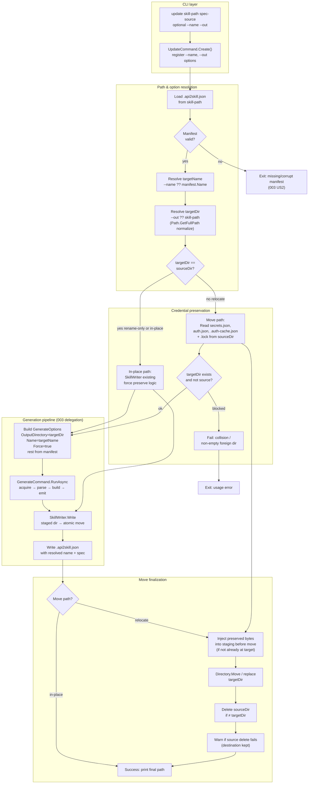
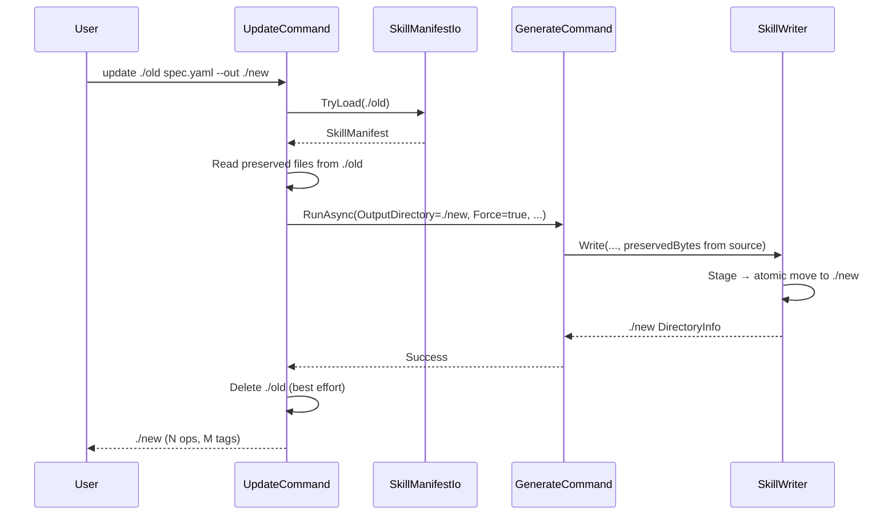

# Implementation Plan: Skill Rename/Move During Update

**Branch**: `feature/004-skill-rename-move-on-update` | **Date**: 2026-07-12 | **Spec**: [spec.md](./spec.md)

**Input**: Feature specification from `specs/004-skill-rename-move-on-update/spec.md`

**Depends on**: Feature 003 (`specs/003-skill-update-command`) — manifest, `UpdateCommand`, `SkillWriter` staged write.

## Summary

Extend `api2skill update` with optional `--name` and `--out` flags (same semantics as `generate`).
When the resolved target directory differs from `<skill-path>`, load credential/cache files from the
**source** directory, regenerate at the **target** via the existing `GenerateCommand.RunAsync`
pipeline, then remove the source directory on success. When only `--name` changes, delegate in place
as today but pass the overridden name into `GenerateOptions`. Preserve 003's thin-delegation model
where possible; add a small **relocate orchestration** layer in `UpdateCommand` plus a
**cross-directory preserve** hook in `SkillWriter` (or a dedicated helper) so secrets/auth/cache
survive moves without duplicating the emit pipeline.

## Technical Context

**Language/Version**: C# on .NET 10, `src/Api2Skill` CLI (unchanged).

**Primary Dependencies**: None new — continues `System.Text.Json.Nodes` for manifest I/O.

**Storage**: Filesystem only. `.api2skill.json` rewritten at the **final** directory after every
successful update (003 FR-007 extended to new path).

**Testing**: xUnit — unit (path resolution, preserve-from-source logic), CLI exit codes (collision,
missing manifest), integration (generate → populate secrets/auth/cache → update with `--name` /
`--out` → assert preservation + old dir removed).

**Target Platform**: Cross-platform .NET tool (same as 003).

**Project Type**: CLI extension — no new commands, extends existing `update`.

**Performance Goals**: Same envelope as `generate --force`; cross-directory move may add one extra
directory read + delete.

**Constraints**: Manifest remains secret-free (Constitution IV). Auth config never changed by
update (003 FR-008). No partial output at destination (003 FR-005 / FR-009).

**Scale/Scope**: ~2–3 source files touched, 1 new test file or extensions to existing update tests.

## Implementation Graph

The diagram below is the canonical dependency/flow graph for this feature. Implementation should
follow node order: CLI options → path resolution → preserve source → generate → manifest rewrite →
atomic finalize → source cleanup.



### Sequence (relocate path)



## Technical Approach

### CLI shape (decision)

Use **`--name`** and **`--out`** on `update` — **not** `--move-to`.

| Flag | Semantics |
|------|-----------|
| `--name` | Override skill name (same as `generate`); updates manifest, `SKILL.md`, script metadata |
| `--out` / `-o` | Override output directory (same as `generate`); when different from `<skill-path>`, triggers relocate flow |

Rationale: users already know these flags from `generate`; avoids a third synonym. `<skill-path>`
always means "where the skill is today"; `--out` means "where it should land after this update".

### UpdateCommand changes

1. Add `--name` and `--out` options to `UpdateCommand.Create()` (mirror `GenerateCommand` descriptions).
2. In `RunAsync`, after loading manifest:
   - `targetName = newName ?? manifest.Name`
   - `targetDir = newOut ?? skillPath` (full-path normalized)
   - `sourceDir = skillPath` (full-path normalized)
3. If `targetDir != sourceDir`:
   - Pre-flight: if `targetDir` exists and is not `sourceDir`, fail unless empty or safe overwrite rules met (FR-006).
   - Read preserve set from `sourceDir` before calling generate.
   - Pass `OutputDirectory = targetDir` into `GenerateOptions`.
   - After successful generate, delete `sourceDir` (FR-004); log warning on delete failure (edge case).
4. If `targetDir == sourceDir` and `--name` provided: pass overridden `Name` only (FR-002).
5. Continue delegating to `GenerateCommand.RunAsync` — no duplicate pipeline.

### SkillWriter / preserve helper

**Option A (preferred)**: Extend `SkillWriter.Write` with optional `PreserveFromDirectory` string —
when `outputDirectory` does not yet exist (or differs from preserve source), read
`secrets.json`/`auth.json`/`.auth-cache.json` from that directory instead of only from `targetDir`
when `force` is true.

**Option B**: `UpdateCommand` reads bytes and passes them through new optional parameters on
`SkillWriter.Write` (mirrors existing in-memory preserve buffers).

Choose minimal diff at implementation time; plan assumes **Option A** for cleaner move semantics.

### Manifest rewrite

No schema change. `GenerateCommand` already builds manifest from resolved `name` + options — ensure
`UpdateCommand` passes the **post-override** name so FR-007 holds at the final directory.

### Source cleanup

After successful write to a new directory, `Directory.Delete(sourceDir, recursive: true)` with
try/catch — failure surfaces as stderr warning, exit code still success if generation succeeded
(spec edge case: move succeeds, delete fails).

## Constitution Check

*GATE: Must pass before Phase 0 research. Re-checked after Phase 1 design.*

| Principle | Plan compliance | Status |
|-----------|-----------------|--------|
| I. Scripts, not compiled clients | No change to emitter output shape beyond name/path metadata | ✅ |
| II. .NET-native, zero unnecessary deps | Filesystem + existing JSON helpers only | ✅ |
| III. Pluggable emitters | Emitter selection unchanged; manifest still records `scriptKind` | ✅ |
| IV. Secrets never committed | Manifest still secret-free; preserved files copied byte-for-byte, never embedded in manifest | ✅ |
| V. Progressive disclosure | No manifest content loaded into SKILL.md | ✅ |
| Untrusted-HTTPS opt-in only | `insecure` only persisted/reused from manifest | ✅ |
| Test-first default | Integration tests for rename, move, combined, regression (no flags) | ✅ |

**Result: PASS — no violations.**

## Project Structure

### Documentation (this feature)

```text
specs/004-skill-rename-move-on-update/
├── spec.md              # /speckit.specify (canonical)
├── plan.md              # This file (/speckit-plan) — includes implementation graph
├── tasks.md             # /speckit-tasks
└── checklists/
    └── requirements.md  # Spec quality checklist
```

### Source Code (repository root)

```text
src/Api2Skill/
├── Cli/
│   ├── UpdateCommand.cs        # MODIFY — + --name, --out; relocate orchestration
│   └── GenerateCommand.cs      # possibly unchanged if manifest already uses resolved name
├── Output/
│   └── SkillWriter.cs          # MODIFY — preserve-from-source directory for cross-dir moves

tests/Api2Skill.Tests/
├── Cli/
│   └── UpdateCommandTests.cs           # EXTEND — collision, flag parsing, rename-only
└── Integration/
    └── UpdateCommandIntegrationTests.cs  # EXTEND — rename, move, rename+move, 003 regression
```

**Structure Decision**: Stay within 003's file layout — no new commands, no manifest schema v2.
Relocate logic lives in `UpdateCommand`; byte preservation extension in `SkillWriter`.

## Design Decisions

| Decision | Choice | Alternatives rejected |
|----------|--------|---------------------|
| CLI flags | `--name` + `--out` | `--move-to` — redundant with existing `--out`; users already know `--out` |
| Pipeline | Delegate to `GenerateCommand.RunAsync` | Separate move-then-generate script — duplicates 003 |
| Source delete | Best-effort after success | Transactional two-phase rollback — overkill; destination correctness matters more |
| Folder rename on `--name` only | Do not auto-rename disk folder | Auto-rename folder — surprising; user can pass `--out` if they want folder rename |

## Complexity Tracking

> No Constitution violations — section intentionally empty.

| Violation | Why Needed | Simpler Alternative Rejected Because |
|-----------|------------|---------------------------------------|
| — | — | — |

## Phase boundary

`/speckit-plan` ends here. Next: `/speckit-tasks` produces `tasks.md`; then `/speckit.implement`.
