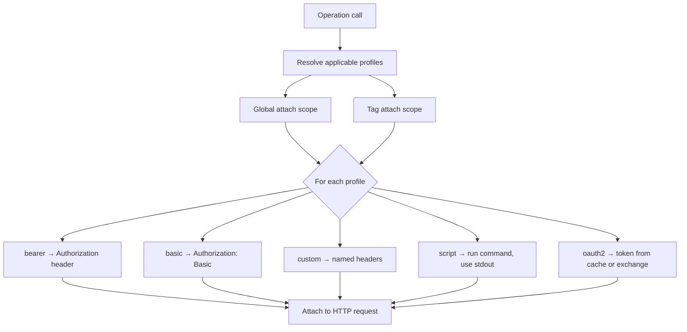

# Authentication

api2skill supports explicit, committed auth configuration via `auth.json`, a quick `--auth`
shorthand for simple cases, and legacy OpenAPI security-scheme scaffolding in `secrets.json`.

**Credentials never come from the OpenAPI spec** — they live in git-ignored `secrets.json`
(or are obtained at runtime via OAuth login / script commands).

## Auth resolution flow



Profiles are defined in `auth.json` (or scaffolded by `--auth`). Multiple profiles can apply
to one operation; header-name collisions across applicable profiles fail at generation time.

## Two ways to configure auth at generation time

### `--auth` shorthand

Quick single-profile scaffold for simple APIs:

```bash
api2skill generate ./api.json --auth bearer
api2skill generate ./api.json --auth basic
api2skill generate ./api.json --auth custom
```

Mutually exclusive with `--auth-config`. Does **not** support `oauth2`, `entra`, or `script` —
use `--auth-config` for those.

### `--auth-config` (full `auth.json`)

```bash
api2skill generate ./api.json --auth-config ./auth.json
api2skill generate ./api.json --auth-config ./auth.json --login
```

`--login` runs interactive OAuth login for each `authorization_code` profile immediately after
generation, priming `.auth-cache.json`.

Full contract: [specs/002-explicit-auth-config/contracts/auth-config.md](../specs/002-explicit-auth-config/contracts/auth-config.md).

## Profile types

### Bearer

```json
{
  "profiles": [
    {
      "name": "api",
      "type": "bearer",
      "token": "{secret:API_TOKEN}"
    }
  ]
}
```

Sends `Authorization: <token>`, prepending `Bearer ` if absent.

### Basic

```json
{
  "profiles": [
    {
      "name": "api",
      "type": "basic",
      "username": "{secret:USERNAME}",
      "password": "{secret:PASSWORD}"
    }
  ]
}
```

### Custom headers

```json
{
  "profiles": [
    {
      "name": "gateway",
      "type": "custom",
      "headers": [
        { "name": "Authorization", "value": "{secret:GW_TOKEN}" },
        { "name": "X-Api-Key", "value": "{secret:GW_KEY}" }
      ]
    }
  ]
}
```

### Script (shell command)

Runs a local command on **every call**; trimmed stdout becomes the header value. Useful for
tokens from CLIs like Azure CLI:

```json
{
  "profiles": [
    {
      "name": "azure",
      "type": "script",
      "command": "az account get-access-token --query accessToken -o tsv",
      "header": "Authorization",
      "bearerPrefix": true
    }
  ]
}
```

Non-zero exit code fails the call and surfaces stderr. The command is user-controlled local
execution — document trust boundaries in your team's runbooks.

### OAuth2

Supports `client_credentials` and `authorization_code` grants.

**Client credentials:**

```json
{
  "profiles": [
    {
      "name": "service",
      "type": "oauth2",
      "grant": "client_credentials",
      "tokenUrl": "https://auth.example.com/oauth/token",
      "clientId": "{secret:CLIENT_ID}",
      "clientSecret": "{secret:CLIENT_SECRET}",
      "scopes": ["api.read"]
    }
  ]
}
```

**Authorization code (with `--login`):**

```json
{
  "profiles": [
    {
      "name": "user",
      "type": "oauth2",
      "grant": "authorization_code",
      "authUrl": "https://auth.example.com/authorize",
      "tokenUrl": "https://auth.example.com/token",
      "callbackUrl": "http://localhost:8400/callback",
      "clientId": "{secret:CLIENT_ID}",
      "clientSecret": "{secret:CLIENT_SECRET}",
      "scopes": ["openid", "offline_access"]
    }
  ]
}
```

**Microsoft Entra preset:**

```json
{
  "profiles": [
    {
      "name": "entra",
      "type": "oauth2",
      "grant": "authorization_code",
      "preset": "entra",
      "tenant": "contoso.onmicrosoft.com",
      "clientId": "{secret:CLIENT_ID}",
      "clientSecret": "{secret:CLIENT_SECRET}",
      "scopes": ["api://my-app-id/.default", "offline_access"]
    }
  ]
}
```

The `entra` preset fills `authUrl` and `tokenUrl` from the tenant. Runtime login uses PKCE
(S256) and anti-CSRF `state` automatically.

### Interactive login

```bash
# After generation — primes .auth-cache.json
api2skill generate ./api.json --auth-config ./auth.json --login

# Or later, inside the skill directory
dotnet run scripts/call.cs -- login user
```

`client_credentials` profiles fetch tokens on demand — they are not valid `login` targets.

## Profile attachment

```json
{ "attach": { "scope": "global" } }
```

```json
{ "attach": { "scope": "tags", "tags": ["Admin", "Billing"] } }
```

Omitted `attach` defaults to global. All applicable profiles apply to an operation.

## Secret references

Any string value may be `{secret:NAME}` — resolved at call time from `secrets.json[NAME]`.
Missing secrets fail the call with a clear error naming `NAME`. The generator scaffolds every
referenced name into `secrets.example.json` as an empty placeholder.

Example `secrets.json` (never commit real values):

```json
{
  "API_TOKEN": "your-token-here",
  "CLIENT_ID": "app-id",
  "CLIENT_SECRET": "app-secret"
}
```

## Legacy OpenAPI security schemes

When no `auth.json` is supplied, the generator scaffolds credentials from OpenAPI security
schemes into `secrets.json`:

| Scheme | `secrets.json` keys |
|--------|---------------------|
| API key | `apiKey` |
| Bearer | `bearerToken` |
| HTTP Basic | `username`, `password` |
| OAuth2 client-credentials | `clientId`, `clientSecret`, `tokenUrl`, optional `scopes` |

Explicit `auth.json` is preferred for multi-profile, OAuth authorization-code, Entra, and
script-based auth.

## Update behavior

`api2skill update` does **not** accept `--auth` or `--auth-config`. Existing `auth.json`,
`secrets.json`, and `.auth-cache.json` are preserved. To change auth configuration, use
`generate --force` with new auth flags.
