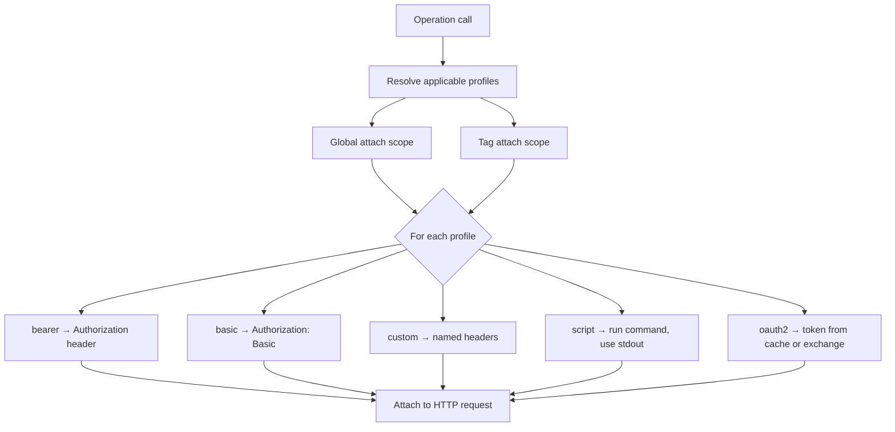

# Authentication

api2skill supports explicit, committed auth configuration via `auth.json`, a quick `--auth`
shorthand for simple cases, and legacy OpenAPI security-scheme scaffolding in `secrets.json`.

**Credentials never come from the OpenAPI spec** — they live in git-ignored `secrets.json`
(or are obtained at runtime via OAuth login / script commands).

## Auth resolution flow



Profiles are defined in `auth.json` (or scaffolded by `--auth`, or auto-scaffolded on first
`generate` — see below). Multiple profiles can apply to one operation; header-name collisions
across applicable profiles fail at generation time.

## Auto-scaffold `auth.json` (first generate)

When you run `generate` **without** `--auth` or `--auth-config`, and the filtered spec
references at least one security scheme, api2skill writes an **inactive** `auth.json` template
into the skill directory:

- Profile `name` values match OpenAPI security scheme IDs (e.g. `bearerAuth` → profile
  `bearerAuth`).
- Supported schemes become active global-attach profiles with `{secret:…}` placeholders only.
- Unsupported or manual-only schemes (e.g. `openIdConnect`, query `apiKey`) are listed in
  `_guidance` / `SKILL.md` but omitted from active `profiles`.
- `_tagAttachExamples` shows copy-paste tag-scoped profiles when tags use different schemes.

The template is **not** loaded as explicit auth on that run — calls still use spec-derived auth
until you edit the file and re-run with `--auth-config`.

```bash
# First generate — writes inactive auth.json + SKILL.md "Auth profile names" section
api2skill generate ./multi-auth.yaml --out ./my-skill

# Edit auth.json / secrets.json, then activate explicit auth
api2skill generate ./multi-auth.yaml --auth-config ./my-skill/auth.json --force --out ./my-skill
```

Contract: [specs/006-auth-template-scaffold/contracts/auth-scaffold.md](../specs/006-auth-template-scaffold/contracts/auth-scaffold.md).

On `--force`, an existing `auth.json` is preserved byte-for-byte (no re-scaffold).

## Two ways to configure auth at generation time

### `--auth` shorthand

Quick single-profile scaffold for simple APIs:

```bash
api2skill generate ./api.json --auth bearer
api2skill generate ./api.json --auth basic
api2skill generate ./api.json --auth custom
```

Mutually exclusive with `--auth-config`. Does **not** support `oauth2`, `entra`, or `script` —
use `--auth-config` for those.

### `--auth-config` (full `auth.json`)

```bash
api2skill generate ./api.json --auth-config ./auth.json
api2skill generate ./api.json --auth-config ./auth.json --login
```

`--login` runs interactive OAuth login for each `authorization_code` profile immediately after
generation, priming `.auth-cache.json`.

Full contract: [specs/002-explicit-auth-config/contracts/auth-config.md](../specs/002-explicit-auth-config/contracts/auth-config.md).

## Profile types

### Bearer

```json
{
  "profiles": [
    {
      "name": "api",
      "type": "bearer",
      "token": "{secret:API_TOKEN}"
    }
  ]
}
```

Sends `Authorization: <token>`, prepending `Bearer ` if absent.

### Basic

```json
{
  "profiles": [
    {
      "name": "api",
      "type": "basic",
      "username": "{secret:USERNAME}",
      "password": "{secret:PASSWORD}"
    }
  ]
}
```

### Custom headers

```json
{
  "profiles": [
    {
      "name": "gateway",
      "type": "custom",
      "headers": [
        { "name": "Authorization", "value": "{secret:GW_TOKEN}" },
        { "name": "X-Api-Key", "value": "{secret:GW_KEY}" }
      ]
    }
  ]
}
```

### Script (shell command)

Runs a local command on **every call**; trimmed stdout becomes the header value. Useful for
tokens from CLIs like Azure CLI:

```json
{
  "profiles": [
    {
      "name": "azure",
      "type": "script",
      "command": "az account get-access-token --query accessToken -o tsv",
      "header": "Authorization",
      "bearerPrefix": true
    }
  ]
}
```

Non-zero exit code fails the call and surfaces stderr. The command is user-controlled local
execution — document trust boundaries in your team's runbooks.

Script commands run with the **skill root** (the directory containing `auth.json`) as the
process working directory, so relative paths like `./get-token.sh` resolve next to the skill
folder regardless of where you invoke `dotnet run`.

### OAuth2

Supports `client_credentials` and `authorization_code` grants.

**Client credentials:**

```json
{
  "profiles": [
    {
      "name": "service",
      "type": "oauth2",
      "grant": "client_credentials",
      "tokenUrl": "https://auth.example.com/oauth/token",
      "clientId": "{secret:CLIENT_ID}",
      "clientSecret": "{secret:CLIENT_SECRET}",
      "scopes": ["api.read"]
    }
  ]
}
```

**Authorization code (with `--login`):**

```json
{
  "profiles": [
    {
      "name": "user",
      "type": "oauth2",
      "grant": "authorization_code",
      "authUrl": "https://auth.example.com/authorize",
      "tokenUrl": "https://auth.example.com/token",
      "callbackUrl": "http://localhost:8400/callback",
      "clientId": "{secret:CLIENT_ID}",
      "clientSecret": "{secret:CLIENT_SECRET}",
      "scopes": ["openid", "offline_access"]
    }
  ]
}
```

**Microsoft Entra preset:**

```json
{
  "profiles": [
    {
      "name": "entra",
      "type": "oauth2",
      "grant": "authorization_code",
      "preset": "entra",
      "tenant": "contoso.onmicrosoft.com",
      "clientId": "{secret:CLIENT_ID}",
      "clientSecret": "{secret:CLIENT_SECRET}",
      "scopes": ["api://my-app-id/.default", "offline_access"]
    }
  ]
}
```

The `entra` preset fills `authUrl` and `tokenUrl` from the tenant. Runtime login uses PKCE
(S256) and anti-CSRF `state` automatically.

**Public client (PKCE only — no `clientSecret`):**

Omit `clientSecret` when the IdP registers a public/native client. Runtime login still adds
PKCE (`code_challenge` / `code_verifier`) and `state` automatically; the token exchange sends
`client_id` in the form body (`clientAuth: "body"`, the default).

```json
{
  "profiles": [
    {
      "name": "user",
      "type": "oauth2",
      "grant": "authorization_code",
      "authUrl": "https://auth.example.com/oauth/authorize",
      "tokenUrl": "https://auth.example.com/oauth/token",
      "callbackUrl": "http://localhost:8400/callback",
      "clientId": "{secret:CLIENT_ID}",
      "scopes": ["openid", "offline_access"]
    }
  ]
}
```

```json
{
  "CLIENT_ID": "your-public-client-id"
}
```

#### Custom authorize and token requests

Some IdPs require extra query parameters on the authorize URL, custom HTTP headers on the token
POST, or additional `application/x-www-form-urlencoded` fields on token exchange / refresh. Use
`authorizeRequest` and `tokenRequest` on the profile:

| Block | `headers` | `body` |
|-------|-----------|--------|
| `authorizeRequest` | **Ignored** — login opens a browser URL; HTTP headers cannot be attached to navigation | Extra **query parameters** merged into the authorize URL |
| `tokenRequest` | Custom HTTP headers on the token/refresh POST | Extra form fields merged into the URL-encoded POST body |

`client_id` is sent automatically from the profile's `clientId` field (resolved from
`secrets.json`). You usually do **not** need to duplicate it in `tokenRequest.body` unless the
provider expects a different field name. Values in `authorizeRequest` / `tokenRequest` are
literals (they are not `{secret:…}`-resolved).

**Example — public client, extra authorize query params, CORS/origin headers + body on token
exchange:**

```json
{
  "profiles": [
    {
      "name": "user",
      "type": "oauth2",
      "grant": "authorization_code",
      "authUrl": "https://auth.example.com/oauth/authorize",
      "tokenUrl": "https://auth.example.com/oauth/token",
      "callbackUrl": "http://localhost:8400/callback",
      "clientAuth": "body",
      "clientId": "{secret:CLIENT_ID}",
      "scopes": ["openid", "offline_access"],
      "authorizeRequest": {
        "body": {
          "prompt": "consent"
        }
      },
      "tokenRequest": {
        "headers": {
          "Origin": "https://app.example.com",
          "X-Rewrite-Origin": "https://app.example.com"
        },
        "body": {
          "resource": "my-api"
        }
      }
    }
  ]
}
```

`authorizeRequest.body` becomes query string parameters on the browser URL (e.g.
`…&prompt=consent`). `tokenRequest.headers` are sent on the POST to `tokenUrl` during code
exchange and refresh. `tokenRequest.body` fields are merged alongside the standard OAuth fields
(`grant_type`, `code`, `code_verifier`, `client_id`, etc.).

**Microsoft Entra with custom token headers:**

```json
{
  "profiles": [
    {
      "name": "aad",
      "type": "oauth2",
      "grant": "authorization_code",
      "preset": "entra",
      "tenant": "contoso.onmicrosoft.com",
      "clientId": "{secret:CLIENT_ID}",
      "scopes": ["api://<app-id>/.default", "offline_access"],
      "tokenRequest": {
        "headers": {
          "Origin": "https://myapp.example.com"
        }
      }
    }
  ]
}
```

**Limitations:**

- `authorizeRequest.headers` has no effect — if an IdP requires origin rewrite as an HTTP header
  on authorize, use a proxy in front of the IdP or pass equivalent values via
  `authorizeRequest.body` when the provider accepts them as query parameters.
- `clientAuth: "body"` (default) sends `client_id` (and `client_secret` when set) in the form;
  use `"basic"` only when the provider expects `Authorization: Basic …` instead.

### Interactive login

```bash
# After generation — primes .auth-cache.json
api2skill generate ./api.json --auth-config ./auth.json --login

# Or later, inside the skill directory
dotnet run scripts/call.cs -- login user
```

`client_credentials` profiles fetch tokens on demand — they are not valid `login` targets.

By default (`browserLaunch` omitted, or `"auto"`) `login` tries to open the authorize URL in the
OS default browser. Set `"browserLaunch": "clipboard"` on an `authorization_code` profile to skip
launching a browser entirely — `login` instead copies the authorize URL to the system clipboard
(native OS clipboard tool, no new dependency) and prints it, so you can paste it into whichever
browser you prefer. The local callback listener behavior (`callbackUrl`, default
`http://localhost:8400/callback`) is unchanged either way.

```json
{
  "name": "user",
  "type": "oauth2",
  "grant": "authorization_code",
  "authUrl": "https://auth.example.com/authorize",
  "tokenUrl": "https://auth.example.com/token",
  "callbackUrl": "http://localhost:8400/callback",
  "browserLaunch": "clipboard",
  "clientId": "{secret:CLIENT_ID}",
  "clientSecret": "{secret:CLIENT_SECRET}",
  "scopes": ["openid", "offline_access"]
}
```

## Profile attachment

```json
{ "attach": { "scope": "global" } }
```

```json
{ "attach": { "scope": "tags", "tags": ["Admin", "Billing"] } }
```

Omitted `attach` defaults to global. All applicable profiles apply to an operation.

## Secret references

Any string value may be `{secret:NAME}` — resolved at call time from `secrets.json[NAME]`.
Missing secrets fail the call with a clear error naming `NAME`. The generator scaffolds every
referenced name into `secrets.example.json` as an empty placeholder.

Example `secrets.json` (never commit real values):

```json
{
  "API_TOKEN": "your-token-here",
  "CLIENT_ID": "app-id",
  "CLIENT_SECRET": "app-secret"
}
```

## Legacy OpenAPI security schemes

When no `auth.json` is supplied, the generator scaffolds credentials from OpenAPI security
schemes into `secrets.json`:

| Scheme | `secrets.json` keys |
|--------|---------------------|
| API key | `apiKey` |
| Bearer | `bearerToken` |
| HTTP Basic | `username`, `password` |
| OAuth2 client-credentials | `clientId`, `clientSecret`, `tokenUrl`, optional `scopes` |

Explicit `auth.json` is preferred for multi-profile, OAuth authorization-code, Entra, and
script-based auth.

## Update behavior

`api2skill update` does **not** accept `--auth` or `--auth-config`. Existing `auth.json`,
`secrets.json`, and `.auth-cache.json` are preserved. To change auth configuration, use
`generate --force` with new auth flags.
