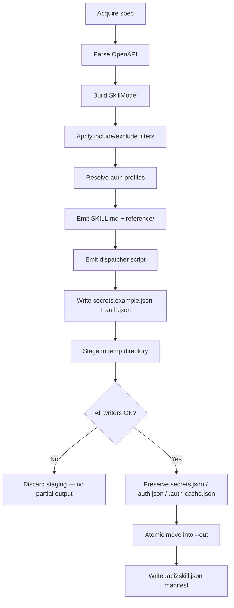

# Generate Command

```
api2skill generate <spec-source> [options]
```

Converts an OpenAPI/Swagger document into a Claude Agent Skill directory.

## Spec source

| Form | Meaning |
|------|---------|
| File path | Read directly (`.json`, `.yaml`, `.yml`, or format auto-detected) |
| `http://` / `https://` URL | Fetched with api2skill's `HttpClient` (honors `--insecure`) |
| `-` | Read from stdin (use `--format` when needed) |

## Options

| Option | Alias | Default | Description |
|--------|-------|---------|-------------|
| `--out <dir>` | `-o` | `./<slug-of-title>` | Output directory |
| `--name <name>` | | slug of `info.title` | Override skill name / output slug |
| `--script <kind>` | | `cs` | Emitter: `cs`, `fsx`, or `csx` |
| `--include <sel>` | | (all operations) | Keep matching selectors (repeatable or comma-joined) |
| `--exclude <sel>` | | (none) | Drop selectors after `--include` |
| `--force` | `-f` | off | Regenerate over an existing directory |
| `--insecure` | | off | Dev-only: accept untrusted TLS (fetch + baked into dispatcher default) |
| `--format <fmt>` | | sniffed | Force input format: `json` or `yaml` |
| `--base-url <url>` | | from spec `servers` | Base URL when the spec has none |
| `--auth-config <path>` | | | Path to `auth.json` (mutually exclusive with `--auth`) |
| `--auth <type>` | | | Shorthand: `bearer`, `basic`, or `custom` |
| `--login` | | off | After write, run interactive login for `authorization_code` profiles |

See [Authentication](Authentication.md) for auth details.

## Generate pipeline



Generation is **all-or-nothing**: content is written to a sibling staging directory
(`.<name>.api2skill-staging-<guid>`) and only moved into place once every file succeeds. On
failure, no output directory is created (or, with `--force`, the existing skill is left
untouched).

## Filtering (`--include` / `--exclude`)

Selector grammar:

```
tag:<tagName>        # e.g. tag:Charges
op:<operationId>     # e.g. op:createCharge
path:<glob>          # e.g. path:/v1/charges*  ('*' matches any run of characters)
```

Examples:

```bash
api2skill generate ./stripe.json --include tag:Charges
api2skill generate ./petstore.json --include tag:pet --exclude op:deletePet
```

`--exclude` runs after `--include`. Filtering also recomputes which security schemes appear in
the output — schemes only referenced by excluded operations are omitted.

## Script kinds

| `--script` | Runner |
|------------|--------|
| `cs` (default) | `dotnet run scripts/call.cs --` |
| `fsx` | `dotnet fsi scripts/call.fsx --` |
| `csx` | `dotnet script scripts/call.csx --` (requires `dotnet tool install -g dotnet-script`) |

All three emit full dispatcher implementations — plain `HttpClient` / `System.Text.Json`, no
third-party dependencies in generated code.

## Custom name and output path

```bash
api2skill generate ./petstore.json \
  --name my-petstore \
  --out ./skills/my-petstore \
  --script fsx \
  --include tag:pet
```

Options are recorded in `.api2skill.json` so `update` can replay them later.

## Regenerating (`--force`)

Re-running with the same `--out` fails (exit `3`) unless `--force` is passed. With `--force`:

- `SKILL.md`, `reference/`, dispatcher, `secrets.example.json`, and `.gitignore` are regenerated.
- Existing `secrets.json`, `auth.json`, and `.auth-cache.json` are preserved byte-for-byte.
- A new `--auth-config` or `--auth` replaces `auth.json`; omit both to keep the existing file.

## Exit codes

| Code | Meaning |
|------|---------|
| `0` | Success (stderr may carry non-fatal warnings) |
| `1` | Invalid or unparseable spec |
| `2` | Usage error (bad flags, unknown `--script`, mutual `--auth`/`--auth-config`) |
| `3` | Output directory exists without `--force` |
| `4` | Could not acquire spec (file not found, fetch/TLS failure) |
| `5` | Auth config validation error |

## Examples

```bash
# Scope a large API
api2skill generate ./api.json --include tag:Users,tag:Auth

# Explicit auth config (OAuth2, script, multi-profile)
api2skill generate ./api.json --auth-config ./auth.json --login

# Quick bearer shorthand
api2skill generate ./api.json --auth bearer

# Supply base URL when spec has no servers
api2skill generate ./api.json --base-url https://api.example.com/v1
```
