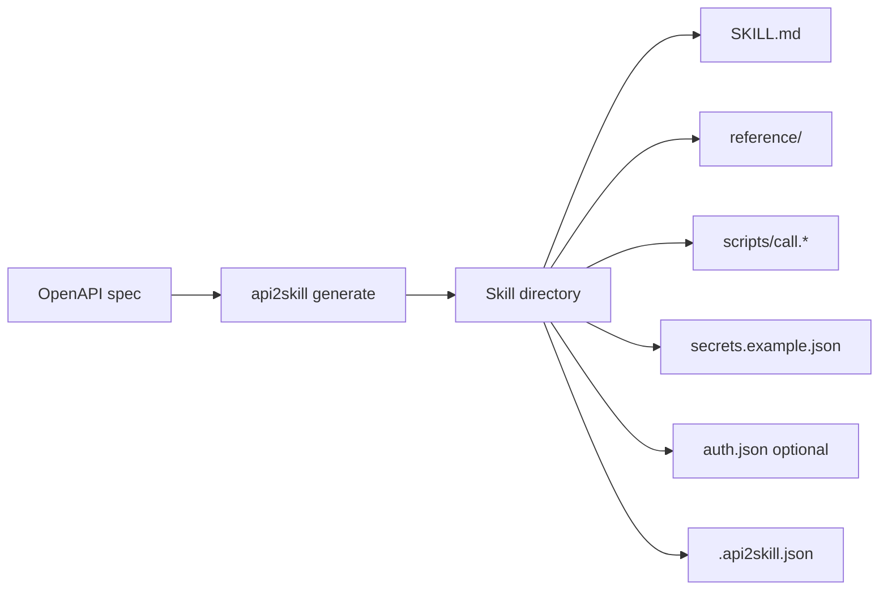

# api2skill Wiki

**api2skill** converts an OpenAPI/Swagger document into a self-contained **Claude Agent Skill** —
`SKILL.md`, reference docs, a runnable dispatcher script, and credential scaffolding — so an
existing REST API becomes something Claude can call correctly, with authentication.

## Quick links

| Page | What you'll find |
|------|------------------|
| [Getting Started](Getting-Started.md) | Install, first skill, where to put it |
| [Generate Command](Generate-Command.md) | Full `generate` reference, filtering, output layout |
| [Update Command](Update-Command.md) | Refresh a skill from a new spec via `.api2skill.json` |
| [Install Creator](Install-Creator.md) | Install `api2skill-creator` into Cursor / Claude / Copilot / Agentic roots |
| [Authentication](Authentication.md) | `auth.json`, `--auth`, OAuth2/Entra, script auth |
| [Examples](Examples.md) | Authored request/response examples (`example` CLI) |
| [Releasing](Releasing.md) | Version bumps, tags, package release notes |
| [How to Read These Docs](README.md) | Browse on GitHub or locally — no separate wiki repo |

## Commands at a glance

```bash
# Create a skill from a spec
api2skill generate ./petstore.json

# Refresh an existing skill (reuses saved options from .api2skill.json)
api2skill update ./my-petstore ./petstore-v2.json

# Install the api2skill-creator helper skill into project agent roots
api2skill install-creator
```

## What gets generated



Each generated skill is a drop-in folder for `~/.claude/skills/` or a project's
`.claude/skills/`.

## Source of truth

This `wiki/` folder in the main repository is the **authoritative documentation**. Edit pages
here and commit with the rest of the project — see [How to Read These Docs](README.md) for
browsing and contribution workflow.

For design contracts and feature specs, see `specs/` in the repository.
