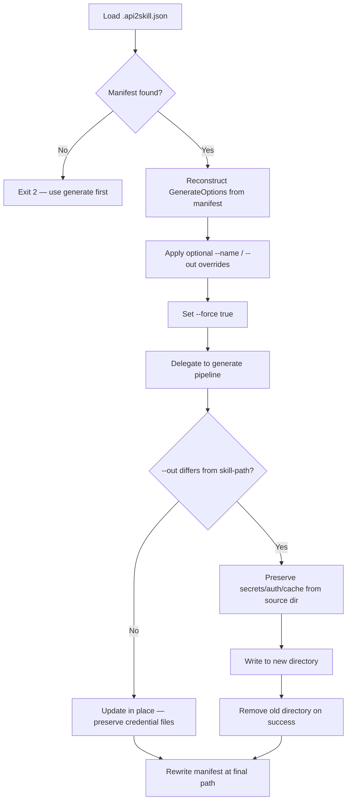

# Update Command

```
api2skill update <skill-path> [<spec-source>] [--name <name>] [--out <dir>]
```

Regenerates a previously generated skill from a newer OpenAPI document, reusing the options
recorded in `.api2skill.json`. Pure delegation to the `generate` pipeline with `--force`.

## Arguments and options

| Argument / option | Description |
|-------------------|-------------|
| `<skill-path>` | Path to an existing skill directory (must contain `.api2skill.json`) |
| `[<spec-source>]` | New spec (file, URL, or `-`). Defaults to the source recorded at generation time |
| `--name <name>` | Rename the skill (same semantics as `generate --name`) |
| `--out <dir>` | `-o` | Relocate the skill (same semantics as `generate --out`) |

## Update flow



## What is preserved

`update` never changes auth configuration — it does not accept `--auth` or `--auth-config`.
The existing preservation rules apply:

| File | Behavior on update |
|------|-------------------|
| `secrets.json` | Preserved byte-for-byte |
| `auth.json` | Preserved (no new auth flags on update) |
| `.auth-cache.json` | Preserved (OAuth session cache) |
| `.api2skill.json` | Rewritten to reflect the latest invocation |

## In-place update

```bash
# Re-fetch the original spec source from the manifest
api2skill update ./skills/my-petstore

# Point at a new spec file or URL
api2skill update ./skills/my-petstore ./petstore-v2.json
```

Manifest fields replayed automatically: `--script`, `--include`, `--exclude`, `--format`,
`--base-url`, `--insecure`, and the skill name (unless overridden).

## Rename and relocate

Optional `--name` and `--out` flags let you rename and/or move a skill while refreshing from a
new spec — credential and cache files move with it.

```bash
# Rename only (stays in the same directory)
api2skill update ./skills/my-petstore ./petstore-v2.json --name petstore-prod

# Relocate only
api2skill update ./skills/my-petstore ./petstore-v2.json --out ./apis/petstore

# Rename and relocate together
api2skill update ./skills/my-petstore ./petstore-v2.json \
  --name petstore-prod --out ./apis/petstore
```

When `--out` points to a different directory:

1. Credential files are read from the **source** directory before generation.
2. The new directory receives regenerated content plus preserved `secrets.json`, `auth.json`, and
   `.auth-cache.json`.
3. The old directory is removed on success (a warning is printed if deletion fails).

The target directory must be empty or nonexistent — `update` will not overwrite an unrelated
non-empty directory.

## When to use `generate` vs `update`

| Situation | Command |
|-----------|---------|
| First-time skill from a spec | `generate` |
| Spec changed, same options | `update <path> <new-spec>` |
| Change filters, script kind, or auth | `generate --force` with new flags |
| Refresh + rename or move | `update` with `--name` / `--out` |

See [specs/003-skill-update-command](../specs/003-skill-update-command/spec.md) and
[specs/004-skill-rename-move-on-update](../specs/004-skill-rename-move-on-update/spec.md).
